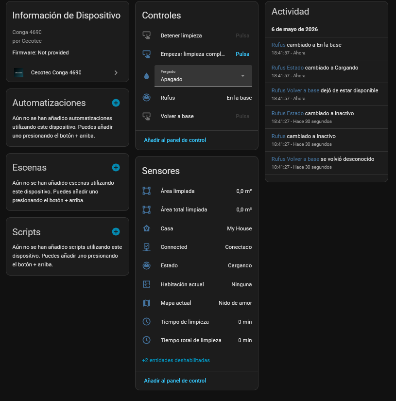

# Cecotec Conga 4690 for Home Assistant

Custom Home Assistant integration for the Cecotec Conga 4690 robot vacuum.

This integration connects to the Cecotec/3irobotix cloud used by the official mobile app and exposes the robot in Home Assistant as a vacuum entity with useful controls and sensors.

## Disclaimer

This project is an independent community integration. It is not affiliated with, endorsed by, sponsored by or supported by Cecotec.

## Features

- Vacuum entity with start, pause, stop and return-to-base controls.
- Fan speed control from the vacuum entity.
- Water level control for mopping mode.
- Cleaning plan start buttons.
- Connection, battery, cleaning time, cleaned area, map name, house name and current room sensors.
- Spanish, English and Catalan translations.
- UI setup through Home Assistant config flow.

## Preview



## Installation With HACS

1. Open HACS in Home Assistant.
2. Go to Integrations.
3. Open the three-dot menu and choose Custom repositories.
4. Add this repository URL.
5. Select Integration as the category.
6. Install Cecotec Conga 4690.
7. Restart Home Assistant.
8. Add the integration from Settings > Devices & services.

## Manual Installation

Copy the `custom_components/cecotec_conga` folder into your Home Assistant `custom_components` directory:

```text
config/custom_components/cecotec_conga
```

Restart Home Assistant, then add the integration from Settings > Devices & services.

## Configuration

The integration asks for the same account credentials used by the Cecotec mobile app.

The cloud service may allow only one active session at a time. If the mobile app is opened, Home Assistant can be logged out temporarily; the integration retries login automatically when needed.

## Notes

- Room cleaning buttons are intentionally not exposed in this release because the cloud API behavior is not reliable enough yet.
- Map rendering is not included in this release.
- This integration has been tested with a Cecotec Conga 4690.

## Support

This project is developed and maintained in personal time. If it helps you, you can support future development here:

[Support the project](https://www.paypal.com/donate/?business=U4AJUCKZXT5PE&no_recurring=0&currency_code=EUR)

Contributions help cover development tools, testing resources and maintenance costs.

## License

MIT License. See `LICENSE.md`.
